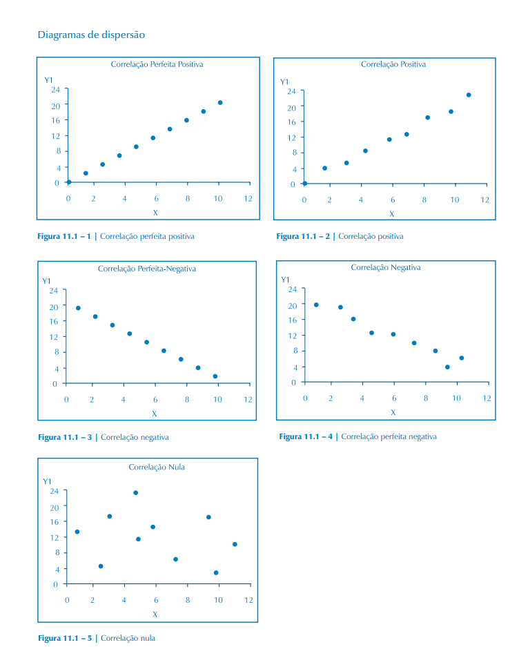

# Correlação linear simples (cap. 11)

Queremos verificar se existe relação entre duas variáveis quantitativas.

O coeficiente de correlação de Pearson, dado por:

    ρxy -> população (rho)
    rxy -> amostra

Esse coeficiente é calculador por:

## Diagrama de dispersão

Vejamos os diferentes casos de correlação com diagramas de dispersão:

## Teste para o coeficiente de correlação

    H0: ρ = 0 (não há correlação)
    H1: ρ != 0 (há correlação)
        p < 0
        p > 0

    tc = rxy * sqrt(n-2) / sqrt(1 - (rxy)^2)
    t α/2, n-2

## Exemplo 

A velocidade máxima de automóveis F1 com motores de mesma potência é a função entre outras variáveis do peso do veículo no intervalo entre 700 e 800 kilogramas. Assim, verificou-se qual a velocidade máxima atingida em uma reta de 1200 metros, os resultados foram:

peso | velocidade
-|-
790|280
780|284
770|291
760|295
750|301

a) esboce o diagrama de dispersão

*imaginação*

---

b) calcule rxy

    sum(x) =  3850
    sum(x^2) = 2965500

    sum(y) = 1451
    sum(y^2) = 421363

    sum(xy) = 1116740

    rxy = (1116740 - 3850*1451/5) / sqrt((2965500 - (3850)^2/5)*(421363-(1451)^2/5))

    rxy = -0.9966

Existe, pois, alta correlação negaativa entre x (o peso) e y (a velocidade máxima).

---

c) teste o coeficiente da correlação alpha = 5%

    tc = -0.9966 * sqrt(5-2) / sqrt(1 - (-0.9966)^2)
    tc = -20.95

    t(5%/2, 3 g.l.) = 3.182

Portanto, rejeita-se H0 e aceita-se H1.
Ou seja, a correlação encontrada é significativa.